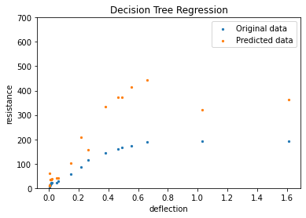
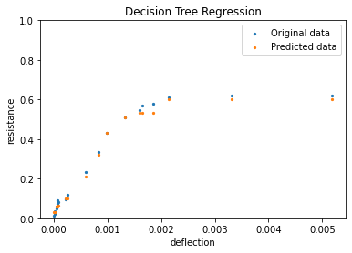

# Supervised Undergraduate Graduation Project: Shear-Wall Resistance Prediction

This repository contains the dataset and Python workflow for an undergraduate graduation project supervised by **Kun Zhang**. The project uses LS-DYNA simulation data to train machine-learning models for predicting the resistance function of reinforced-concrete shear walls.

The original work focused on building a cleaned tabular dataset from LS-DYNA outputs, training a regression model, and comparing predicted resistance values against the simulation-derived response data.

## Project Scope

- Data source: LS-DYNA numerical simulation results for shear-wall response.
- Target problem: resistance-function prediction for reinforced-concrete shear walls.
- Modeling task: supervised regression from geometric, reinforcement, concrete-stress, and deformation features to wall resistance.
- Baseline model: decision-tree regression with cross-validation.
- Interpretation: optional SHAP analysis for feature contribution review.

## Repository Layout

```text
.
|-- all_data.csv                 # Cleaned LS-DYNA-derived dataset
|-- merge_data.py                # Utility for merging raw CSV exports
|-- train_resistance_model.py    # Training, evaluation, plotting, optional SHAP analysis
|-- requirements.txt             # Python dependencies
`-- figures/
    |-- normalized_prediction_comparison.png
    `-- raw_prediction_comparison.png
```

## Dataset

`all_data.csv` contains the merged training dataset. The columns are:

| Column | Meaning |
|---|---|
| `width` | Shear-wall width parameter |
| `height` | Shear-wall height parameter |
| `span` | Wall span parameter |
| `covering` | Concrete cover parameter |
| `num_longitude` | Number of longitudinal reinforcement bars |
| `diameter_longitude` | Diameter of longitudinal reinforcement bars |
| `num_hoop` | Number of hoop reinforcement bars |
| `diameter_hoop` | Diameter of hoop reinforcement bars |
| `concrete_stress` | Concrete stress-related input feature |
| `deflection` | Wall deflection response variable used as an input feature |
| `F_resistance` | Target resistance value |

## Results Preview

The original project compared raw-data training and normalized-data training results.





## Installation

Create a Python environment and install the required packages:

```bash
python -m venv .venv
.venv\Scripts\activate  # Windows PowerShell: .venv\Scripts\Activate.ps1
pip install -r requirements.txt
```

On macOS/Linux:

```bash
python -m venv .venv
source .venv/bin/activate
pip install -r requirements.txt
```

## Usage

Train and evaluate the default model:

```bash
python train_resistance_model.py
```

Write generated figures and metrics to a custom directory:

```bash
python train_resistance_model.py --output-dir results
```

Run without feature normalization:

```bash
python train_resistance_model.py --no-normalize
```

Merge raw CSV files into a single dataset:

```bash
python merge_data.py --input-dir raw_data --output all_data.csv
```

## Notes

This repository is kept as a supervised undergraduate graduation-project record. It is not intended to be a polished production package; the goal is to preserve the data-processing and baseline modeling workflow in a reproducible form.

## Attribution

The project was completed as an undergraduate graduation project under the supervision of Kun Zhang. The repository contains the project dataset and cleaned Python workflow used for model training and result visualization.
